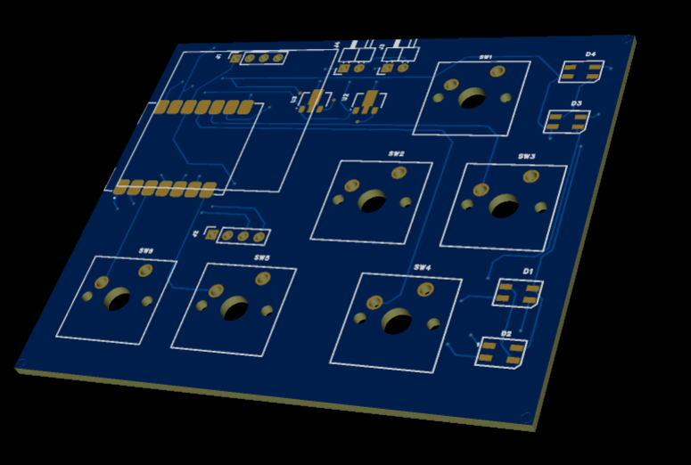
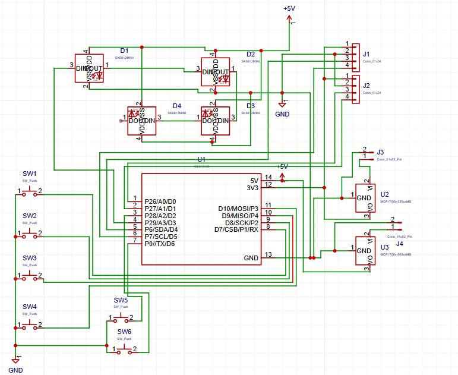
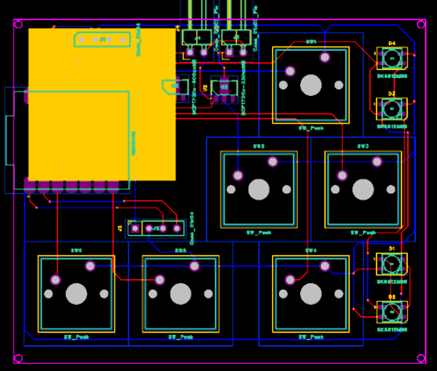

# RP2040 6-Key RGB Macro Pad

A compact RP2040-based macro pad with 6 keys, 4 SK6812 Mini RGB LEDs, and an SSD1306 OLED display.  
Built using MicroPython and KMK.

## Overview

This project is a custom USB macro pad.  
Each key sends a keyboard input, lights up an RGB LED, and the OLED shows basic status text.

---

## Hackpad

---

## Schematic

---

## PCB

---

## Case & Assembly

---

## Bill of Materials (BOM)

| Quantity | Component |
|--------:|-----------|
| 4 | SK6812 Mini RGB LED |
| 1 | MCP1700-330MB Voltage Regulator |
| 1 | MCP1700-500MB Voltage Regulator |
| 6 | MX-Style Mechanical Switch |
| 1 | XIAO-nRF52840-SMD |
| 1 | SSD1306 OLED Display |
| 2 | PinSocket 2.54mm 1x04 Vertical |
| 2 | PinHeader 2.54mm 1x02 Horizontal |

---

## License

For personal and educational use.
